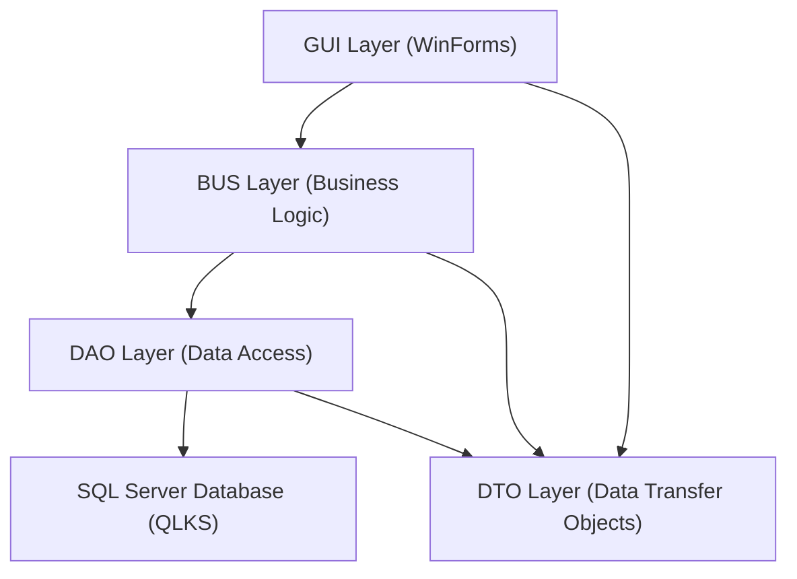
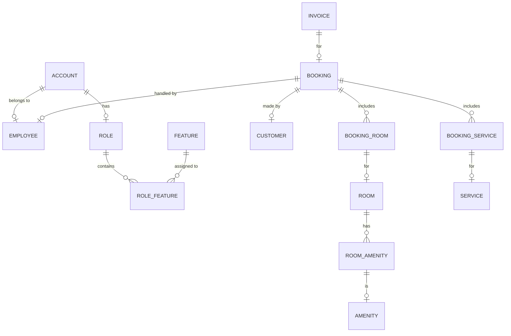

## . Architecture



### Project Structure

```
HotelManagement/
├── DTO/          — Data Transfer Object classes (models)
├── DAO/          — Database.cs (single data access class)
├── BUS/          — Business logic classes (one per entity)
├── GUI/          — Windows Forms UI
│   ├── GUI_HOME/       — Main Dashboard
│   ├── GUI_ROOM/       — Room Management
│   ├── GUI_SERVICE/    — Service Management
│   ├── GUI_CUSTOMER/   — Customer Management
│   ├── GUI_STAFF/      — Employee Management
│   ├── GUI_BOOKING/    — Booking Management
│   ├── GUI_BILL/       — Billing/Invoice
│   ├── GUI_THONGKE/    — Statistics & Reports
│   ├── GUI_ROLE/       — Role/Permission Management
│   └── GUI_COMPONENT/  — Reusable UI components
└── QLKS.sql      — Full database script
```

---

## 3. Database Schema

### 3.1 Entity-Relationship Diagram



### 3.2 Table Definitions

#### ROOM 

| Column | Type | Description |
|---|---|---|
| RoomID (maP) | varchar(20) PK | Auto-generated room identifier |
| RoomName (tenP) | nvarchar(20) | Display name of the room |
| RoomType (loaiP) | smallint | 0 = VIP, 1 = Standard |
| Price (giaP) | int | Room price |
| RoomDetail (chiTietLoaiP) | int | 0 = Single, 1 = Double, 2 = Family |
| Status (tinhTrang) | int | 0 = Available, 1 = Occupied, 2 = Not Cleaned, 3 = Under Repair |
| Condition (hienTrang) | int | 0 = New, 1 = Old |
| IsDeleted (xuLy) | int | 0 = Active, 1 = Soft-deleted |

#### CUSTOMER

| Column | Type | Description |
|---|---|---|
| CustomerID (maKH) | varchar(20) PK | Auto-generated |
| FullName (tenKH) | nvarchar(50) | Customer name |
| IDCard (CMND) | varchar(20) | National ID / Passport |
| Gender (gioiTinh) | smallint | 0 = Male, 1 = Female |
| Phone (sDT) | varchar(20) | Phone number |
| Address (queQuan) | nvarchar(100) | Home address |
| Nationality (quocTich) | nvarchar(100) | Nationality |
| DateOfBirth (ngaySinh) | date | Birth date |
| IsDeleted (xuLy) | int | Soft delete flag |

#### EMPLOYEE

| Column | Type | Description |
|---|---|---|
| EmployeeID (maNV) | varchar(20) PK | Auto-generated |
| FullName (tenNV) | nvarchar(50) | Employee name |
| Gender (gioiTinh) | smallint | 0 = Male, 1 = Female |
| LeaveDays (soNgayPhep) | smallint | Number of leave days |
| Position (chucVu) | smallint | 0 = Manager, 1 = Receptionist |
| DateOfBirth (ngaySinh) | date | Birth date |
| HireDate (ngayVaoLam) | date | Date of joining |
| Email (email) | varchar(100) | Email address |
| DailyWage (luong1Ngay) | int | Salary per day |
| IsDeleted (xuLy) | int | Soft delete flag |

#### ACCOUNT

| Column | Type | Description |
|---|---|---|
| Username (taiKhoan) | varchar(20) PK | Login username |
| EmployeeID (maNV) | varchar(20) FK | Linked employee |
| Password (matKhau) | varchar(max) | Hashed password |
| Status (tinhTrang) | int | Account active status |
| RoleID (maPQ) | varchar(20) FK | Assigned role |
| IsDeleted (xuLy) | int | Soft delete flag |

#### SERVICE

| Column | Type | Description |
|---|---|---|
| ServiceID (maDV) | varchar(20) PK | Auto-generated |
| ServiceName (tenDV) | nvarchar(100) | Name (e.g., Massage, Buffet) |
| ServiceType (loaiDV) | nvarchar(128) | Category (Food & Beverage, Beauty, Entertainment, Party) |
| Price (giaDV) | int | Service price |
| Image (hinhAnh) | nvarchar(max) | Base64-encoded image |
| IsDeleted (xuLy) | int | Soft delete flag |

#### AMENITY

| Column | Type | Description |
|---|---|---|
| AmenityID (maTI) | varchar(20) PK | Auto-generated |
| AmenityName (tenTI) | nvarchar(30) | Name (e.g., TV, Iron, Hair Dryer) |
| IsDeleted (xuLy) | int | Soft delete flag |

#### ROOM_AMENITY 

| Column | Type | Description |
|---|---|---|
| RoomID (maP) | varchar(20) PK/FK | Room reference |
| AmenityID (maTI) | varchar(20) PK/FK | Amenity reference |
| Quantity (soLuong) | int | Number of items |

#### BOOKING

| Column | Type | Description |
|---|---|---|
| BookingID (maCTT) | varchar(20) PK | Auto-generated |
| CustomerID (maKH) | varchar(20) FK | Guest who booked |
| EmployeeID (maNV) | varchar(20) FK | Staff who created booking |
| BookingDate (ngayLapPhieu) | datetime | Date booking was created |
| Deposit (tienDatCoc) | int | Deposit amount |
| ProcessStatus (tinhTrangXuLy) | int | 0 = Pending, 1 = Processed |
| IsDeleted (xuLy) | int | Soft delete flag |

#### BOOKING_ROOM

| Column | Type | Description |
|---|---|---|
| BookingID (maCTT) | varchar(20) PK/FK | Booking reference |
| RoomID (maP) | varchar(20) PK/FK | Room reference |
| CheckInDate (ngayThue) | datetime PK | Check-in date/time |
| CheckOutDate (ngayTra) | datetime | Expected checkout |
| ActualCheckOut (ngayCheckOut) | datetime | Actual checkout |
| RentalType (loaiHinhThue) | int | 0 = By Day, 1 = By Hour, 2 = Flexible |
| RentalPrice (giaThue) | int | Price charged |
| Status (tinhTrang) | int | 0 = Pending, 1 = Checked In, 2 = Checked Out |

#### BOOKING_SERVICE 

| Column | Type | Description |
|---|---|---|
| BookingID (maCTT) | varchar(20) PK/FK | Booking reference |
| ServiceID (maDV) | varchar(20) PK/FK | Service reference |
| UsageDate (ngaySuDung) | date PK | Date of service usage |
| Quantity (SoLuong) | int | Number of times used |
| Price (giaDV) | int | Price at time of usage |

#### INVOICE 

| Column | Type | Description |
|---|---|---|
| InvoiceID (maHD) | varchar(20) PK | Auto-generated |
| BookingID (maCTT) | varchar(20) FK | Linked booking |
| Discount (giamGia) | int | Discount percentage |
| Surcharge (phuThu) | int | Surcharge percentage |
| PaymentDate (ngayThanhToan) | datetime | Date of payment |
| PaymentMethod (phuongThucThanhToan) | smallint | 0 = Cash, 1 = Bank Transfer |
| IsDeleted (xuLy) | int | Soft delete flag |

#### ROLE 

| Column | Type | Description |
|---|---|---|
| RoleID (maPQ) | varchar(20) PK | Role identifier |
| RoleName (tenPQ) | nvarchar(50) | Role name (e.g., Admin, Receptionist) |

#### FEATURE 

| Column | Type | Description |
|---|---|---|
| FeatureID (maChucNang) | varchar(20) PK | Feature code |
| FeatureName (tenChucNang) | nvarchar(100) | Feature name |

**System Features :**
1. Room Management
2. Service Management
3. Customer Management
4. Employee Management
5. Role Management
6. Booking Management
7. Invoice Management
8. View Statistics

#### ROLE_FEATURE 

| Column | Type | Description |
|---|---|---|
| RoleID (maPQ) | varchar(20) PK/FK | Role reference |
| FeatureID (maChucNang) | varchar(20) PK/FK | Feature reference |

---

## 4. Functional Modules (Detailed)

### 4.1 Authentication Module

**Forms:** `frmLogin`, `frmChangePassword`, `frmForgotPassword`, `frmLoading`

| Feature | Description |
|---|---|
| **Login** | Username + password authentication against ACCOUNT table; password is hashed |
| **Change Password** | Authenticated user changes their password with old password verification |
| **Forgot Password** | Sends verification code to employee's registered email via Firebase/Gmail API |
| **Loading Screen** | Splash screen shown during app startup |
| **Role-Based Access** | After login, menu items are shown/hidden based on user's assigned role permissions |

**Business Rules:**
- Account is linked to an Employee record
- Each account has a Role that determines which modules they can access
- Soft-delete flag prevents deleted accounts from logging in

### 4.2 Main Dashboard (Home)

**Form:** `QLKS_Form` (Main MDI parent form)

| Feature | Description |
|---|---|
| **Navigation Sidebar** | Buttons for each module: Room, Service, Customer, Employee, Booking, Bill, Statistics, Role |
| **Dynamic Menu** | Menu items visibility controlled by role-based permissions |
| **User Info Display** | Shows logged-in user's name and role |
| **Logout** | Returns to login screen |

### 4.3 Room Management

**Forms:** `GUI_ROOM/` directory

| Feature | Description |
|---|---|
| **View All Rooms** | DataGridView listing all rooms with status indicators |
| **Add Room** | Create new room with name, type (VIP/Standard), detail (Single/Double/Family), price |
| **Edit Room** | Update room information |
| **Delete Room** | Soft-delete (sets IsDeleted = 1) |
| **Room Status** | Visual indicators: Available, Occupied, Not Cleaned, Under Repair |
| **Room Condition** | Track if room is New or Old |
| **Room Amenities** | Assign amenities (TV, Iron, Hair Dryer, etc.) with quantities to each room |
| **Search/Filter** | Search rooms by name, type, status |

**ID Generation Pattern:** `P` + date(ddMMyy) + sequential number (e.g., `P1404240001`)

### 4.4 Amenity Management

**Forms:** Part of `GUI_ROOM/` or dedicated section

| Feature | Description |
|---|---|
| **View Amenities** | List all amenities (TV, Iron, Hair Dryer, etc.) |
| **Add Amenity** | Create new amenity type |
| **Edit Amenity** | Update amenity name |
| **Delete Amenity** | Soft-delete |
| **Assign to Room** | Link amenities to rooms with quantity |

**ID Pattern:** `TI` + date(ddMMyy) + sequential number

### 4.5 Service Management

**Forms:** `GUI_SERVICE/` directory

| Feature | Description |
|---|---|
| **View Services** | Card/grid view showing service name, type, price, image |
| **Add Service** | Create service with name, category, price, image upload |
| **Edit Service** | Update service details |
| **Delete Service** | Soft-delete |
| **Service Categories** | Food & Beverage, Beauty Care, Entertainment, Party Services |
| **Image Support** | Services have images stored as Base64 in database |
| **Search/Filter** | Filter by category, search by name |

**ID Pattern:** `DV` + date(ddMMyy) + sequential number

### 4.6 Customer Management

**Forms:** `GUI_CUSTOMER/` directory

| Feature | Description |
|---|---|
| **View Customers** | DataGridView with all customer records |
| **Add Customer** | Form with: Name, ID Card, Gender, Phone, Address, Nationality, DOB |
| **Edit Customer** | Update customer information |
| **Delete Customer** | Soft-delete |
| **Search** | Search by name, ID card, phone number |
| **Customer History** | View booking history for a customer |

**ID Pattern:** `KH` + date(ddMMyy) + sequential number

### 4.7 Employee Management

**Forms:** `GUI_STAFF/` directory

| Feature | Description |
|---|---|
| **View Employees** | DataGridView with all staff records |
| **Add Employee** | Form: Name, Gender, Position (Manager/Receptionist), DOB, Hire Date, Email, Daily Wage, Leave Days |
| **Edit Employee** | Update employee information |
| **Delete Employee** | Soft-delete |
| **Excel Import** | Import employee data from Excel spreadsheet |
| **Excel Export** | Export employee list to Excel file |
| **Search** | Search by name, position |
| **Account Linking** | Create/manage login account for employee |

**ID Pattern:** `NV` + date(ddMMyy) + sequential number

### 4.8 Booking Management

**Forms:** `GUI_BOOKING/` directory (most complex module)

| Feature | Description |
|---|---|
| **Booking List** | View all bookings with status (Pending/Processed) |
| **Create Booking** | Multi-step: Select customer → Select rooms → Set dates → Add services → Set deposit |
| **Room Selection** | Visual room picker showing available rooms with status colors |
| **Rental Types** | By Day, By Hour, or Flexible (no return date set) |
| **Add Services to Booking** | Add services with quantity and usage date |
| **Booking Details** | View full breakdown: rooms booked, services used, dates, prices |
| **Check-In** | Mark room as occupied when guest arrives |
| **Check-Out** | Record actual checkout date, calculate final charges |
| **Edit Booking** | Modify rooms, services, dates before checkout |
| **Delete Booking** | Soft-delete |
| **Deposit Tracking** | Record deposit amount at booking time |
| **Print Booking Slip** | Generate printable booking receipt (RDLC report) |

**ID Pattern:** `CTT` + date(ddMMyy) + sequential number

**Booking Workflow:**

```mermaid
flowchart LR
    A[Create Booking] --> B[Select Customer]
    B --> C[Select Rooms]
    C --> D[Set Dates & Type]
    D --> E[Add Services]
    E --> F[Set Deposit]
    F --> G[Booking Created - Pending]
    G --> H[Check-In]
    H --> I[Guest Stay]
    I --> J[Check-Out]
    J --> K[Generate Invoice]
```


### 4.9 Billing / Invoice Management

**Forms:** `GUI_BILL/BillForm`

| Feature | Description |
|---|---|
| **View Invoices** | List all invoices with: ID, Booking ID, Employee, Room Total, Service Total, Discount, Surcharge, Grand Total, Date, Payment Method |
| **Create Invoice** | Generated from completed booking; calculates room charges + service charges |
| **Discount** | Apply percentage discount to total |
| **Surcharge** | Apply percentage surcharge to total |
| **Payment Method** | Cash (0) or Bank Transfer (1) |
| **Invoice Details** | View breakdown of room charges and service charges |
| **Search/Filter** | Filter by date range, payment method |

**Calculation Formula:**
```
Room Total = SUM(all room rental prices)
Service Total = SUM(service price × quantity)
Subtotal = Room Total + Service Total
Surcharge Amount = Subtotal × Surcharge%
Discount Amount = Subtotal × Discount%
Grand Total = Subtotal + Surcharge Amount - Discount Amount
```

**ID Pattern:** `HD` + date(ddMMyy) + sequential number

### 4.10 Statistics & Reports

**Forms:** `GUI_THONGKE/FormChart`

| Feature | Description |
|---|---|
| **Revenue by Room Type** | Pie chart: VIP vs Standard room bookings |
| **Revenue by Room Detail** | Pie chart: Single vs Double vs Family |
| **Room vs Service Revenue** | Compare room charges vs service charges |
| **Daily Revenue** | Room revenue + Service revenue per day |
| **Monthly Revenue** | Room revenue + Service revenue per month |
| **Date Range Filter** | Select from/to dates for statistics |
| **Summary Totals** | Total room revenue, total service revenue, total surcharges, total discounts, grand total |
| **Chart Visualization** | Pie charts and bar charts for visual representation |

### 4.11 Role & Permission Management

**Forms:** `GUI_ROLE/` directory

| Feature | Description |
|---|---|
| **View Roles** | List all roles (e.g., Admin, Receptionist) |
| **Create Role** | Define new role with name |
| **Assign Permissions** | Checkboxes for each of the 8 system features |
| **Edit Role** | Modify role permissions |
| **Delete Role** | Remove role |

**8 System Features (Permissions):**
1. Room Management
2. Service Management
3. Customer Management
4. Employee Management
5. Role Management
6. Booking Management
7. Invoice Management
8. View Statistics

---

## 5. Data Access Layer (DAO) Pattern

The project uses a single `Database.cs` class with ADO.NET:

```csharp
// Connection using SqlConnection
string connectionString = "Server=...; Database=QLKS; User Id=...; Password=...;";

// Methods available:
DataTable getList(string query)                    // SELECT queries returning DataTable
void ExecuteNonQuery(string query)                 // INSERT, UPDATE, DELETE
int ExecuteNonQuery_getInteger(string query)        // Returns scalar int (COUNT, SUM, etc.)
List<PhongDTO> getListPhong_DTO(string query)       // Typed list returns using SqlDataReader
List<KhachHangDTO> getListKH_DTO(string query)      // ... one method per entity type
List<NhanVienDTO> getListNV_DTO(string query)
List<DichVuDTO> getListDV_DTO(string query)
List<TaiKhoanDTO> GetListTK_DTO(string query)
// etc.
```

---

## 6. Business Logic Layer (BUS) Pattern

Each entity has a corresponding BUS class:

| BUS Class | Responsibility |
|---|---|
| `PhongBUS` | Room CRUD, status management |
| `DichVuBUS` | Service CRUD, image handling |
| `KhachHangBUS` | Customer CRUD, search, validation |
| `NhanVienBUS` | Employee CRUD, Excel import/export |
| `TaiKhoanBUS` | Account CRUD, authentication, password hashing |
| `ChiTietThueBUS` | Booking master record management |
| `ChiTietThuePhongBUS` | Booking-Room details, check-in/out |
| `ChiTietThueDichVuBUS` | Booking-Service details |
| `HoaDonBUS` | Invoice creation, revenue calculations, statistics queries |
| `TienIchBUS` | Amenity CRUD |
| `PhanQuyenBUS` | Role management |
| `ChucNangBUS` | Feature/permission management |

---

## 7. Key Design Patterns Used

| Pattern | Implementation |
|---|---|
| **Soft Delete** | All entities use `IsDeleted` (xuLy) flag instead of physical deletion |
| **Auto-ID Generation** | Format: Prefix + Date(ddMMyy) + Sequential Number |
| **3-Tier Architecture** | GUI → BUS → DAO separation |
| **DTO Pattern** | Separate data transfer objects for each entity |
| **MDI (Multiple Document Interface)** | Main form hosts child forms |
| **Role-Based Access Control** | Feature-level permissions per role |

---

## 8. SQL Script Reference

The complete database can be created using the `QLKS.sql` script which includes:
- All `CREATE TABLE` statements with proper constraints
- Primary keys and foreign key relationships
- Sample/seed data for roles, features, and role-feature mappings
- Sample amenity and room data

---

## 9. Recommended New Project Structure (for Course)

### Windows Forms Application (Practicals 04, 06)
```
HotelManagement.sln
├── HotelManagement.DTO/        (Class Library — Practical 03)
│   ├── Room.cs
│   ├── Customer.cs
│   ├── Employee.cs
│   ├── Service.cs
│   ├── Amenity.cs
│   ├── Booking.cs
│   ├── BookingRoom.cs
│   ├── BookingService.cs
│   ├── Invoice.cs
│   ├── Account.cs
│   ├── Role.cs
│   └── Feature.cs
├── HotelManagement.DAO/        (Class Library — Practical 06)
│   └── DatabaseHelper.cs       (ADO.NET connection + CRUD)
├── HotelManagement.BUS/        (Class Library — Practical 03)
│   ├── RoomService.cs
│   ├── CustomerService.cs
│   ├── EmployeeService.cs
│   ├── BookingService.cs
│   ├── InvoiceService.cs
│   └── AuthService.cs
└── HotelManagement.WinForms/   (WinForms App — Practical 04)
    ├── frmLogin.cs
    ├── frmMain.cs (Dashboard)
    ├── frmRoom.cs
    ├── frmCustomer.cs
    ├── frmEmployee.cs
    ├── frmService.cs
    ├── frmBooking.cs
    ├── frmInvoice.cs
    └── frmStatistics.cs
```

### ASP.NET MVC Web Application (Practicals 05, 07)
```
HotelManagement.Web/            (ASP.NET MVC — Practical 05, 07)
├── Controllers/
│   ├── HomeController.cs
│   ├── RoomController.cs
│   ├── CustomerController.cs
│   ├── BookingController.cs
│   ├── InvoiceController.cs
│   └── AccountController.cs
├── Models/                     (Reuse DTOs or Entity Framework)
├── Views/
│   ├── Home/
│   ├── Room/
│   ├── Customer/
│   ├── Booking/
│   ├── Invoice/
│   └── Shared/
└── App_Data/
``
